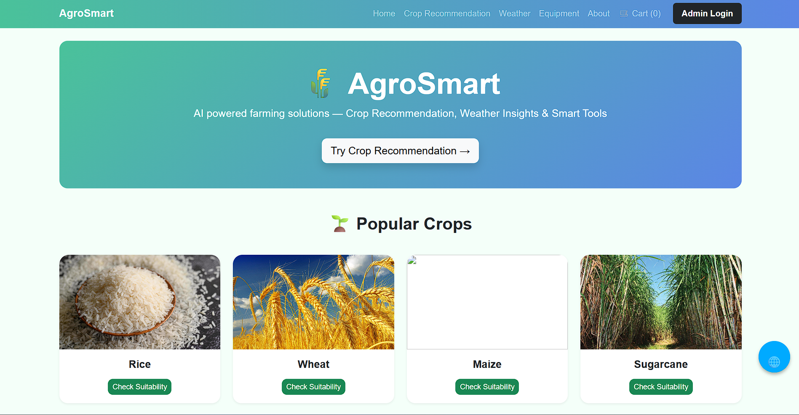
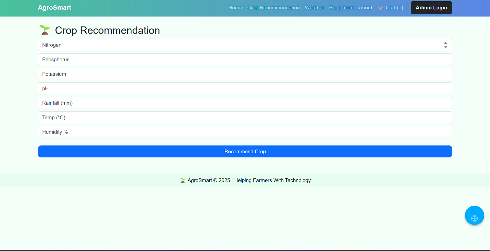
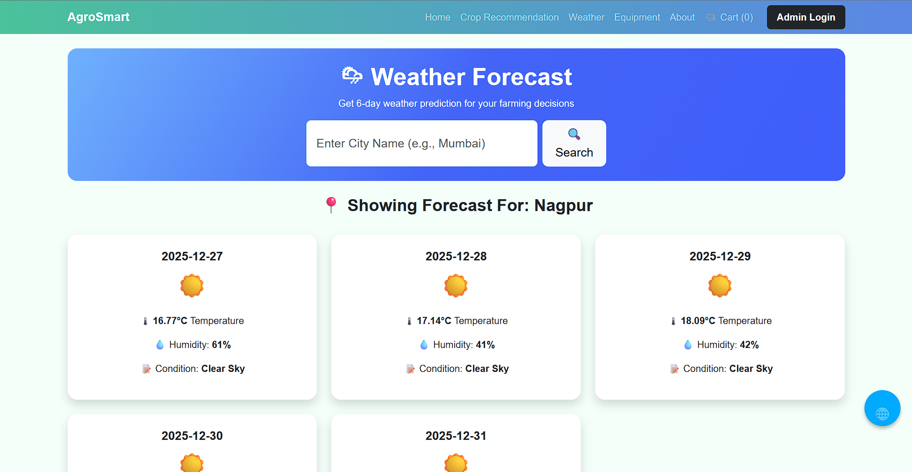
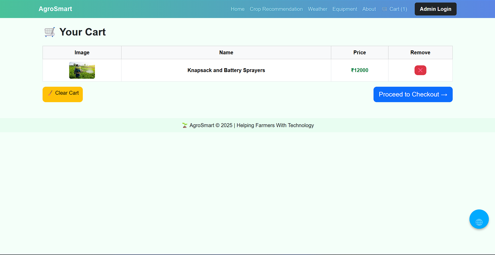
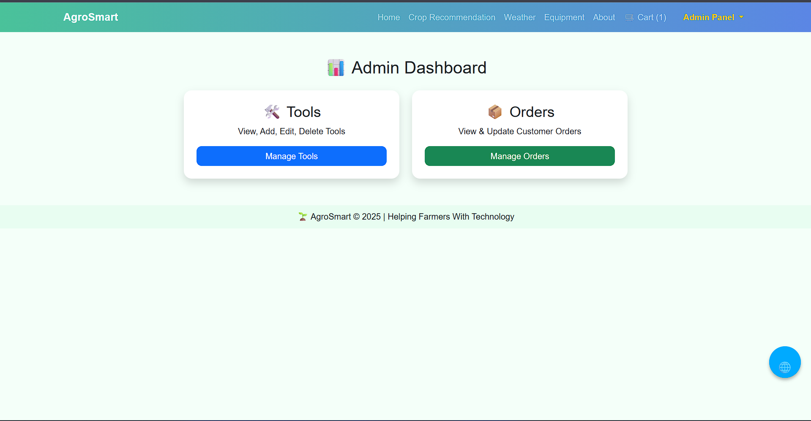

# 🌾 AgroSmart — AI Powered Farming Assistant

AgroSmart is a Flask-based web application designed to help farmers make smart decisions using technology.  
It provides crop recommendations using machine learning, real-time weather forecasts, and an e-commerce tool shop with admin control.

---

## 🚀 Features

| Feature | Description |
|---------|--------------|
| 🌱 Crop Recommendation | Predicts best crop based on soil values (N, P, K, pH, Temp, Humidity, Rain) |
| 🌦 Weather Forecast | 6-day forecast using OpenWeatherMap API |
| 🛒 Equipment Shop | Farmers can browse and add tools to cart |
| 📦 WhatsApp Order | Order via WhatsApp + Save Orders to Database |
| 🛍 Cart + Checkout | Customer name & phone required before order |
| 🔐 Admin Login | Add/Edit/Delete products & manage orders |
| 📊 Dashboard | Manage tools & orders from a single panel |

---

## 🛠 Tech Stack

- **Frontend:** HTML, CSS, Bootstrap
- **Backend:** Python, Flask
- **Database:** SQLite (Local), MongoDB/Firebase (Optional for deployment)
- **APIs:** OpenWeatherMap API, WhatsApp Cloud API
- **ML Model:** Scikit-Learn (pickle `.pkl`)

---

## 📂 Project Structure

```

AgroSmart/
│
├── app.py
├── requirements.txt
├── vercel.json
├── crop_model.pkl
│
├── static/
│   ├── css/
│   │   └── style.css
│   ├── uploads/ (equipment images)
│   └── img/ (crop icons)
│
├── templates/
│   ├── base.html
│   ├── index.html
│   ├── weather.html
│   ├── crop_form.html
│   ├── crop_result.html
│   ├── equipment.html
│   ├── cart.html
│   ├── checkout.html
│   ├── admin_login.html
│   ├── admin_dashboard.html
│   ├── admin_tools.html
│   ├── admin_orders.html
│   └── add/edit tool templates
│
└── README.md

````

---

## 📌 Installation & Setup

### 1️⃣ Clone the Repository
```bash
git clone https://github.com/yourusername/agrosmart-ai.git
cd agrosmart-ai
````

### 2️⃣ Install Requirements

```bash
pip install -r requirements.txt
```

### 3️⃣ Run the App

```bash
python app.py
```

### 4️⃣ Access in browser

```
http://127.0.0.1:5000/
```

---

## 🔑 Environment Variables (Optional)

Create `.env` file if needed:

```
OPENWEATHER_API_KEY = your_api_key
WHATSAPP_ACCESS_TOKEN = your_access_token
WHATSAPP_NUMBER = your_phone
```

---

## 🧠 Machine Learning Model (Crop Prediction)

The model is trained using:

```
N, P, K, Temperature, Humidity, pH, Rainfall
```

Model file used:

```
crop_model.pkl
```

---

## 🌐 Deployment on Vercel

1. Install vercel

```bash
npm i -g vercel
```

2. Configure Flask for Serverless

```json
// vercel.json
{
  "builds":[{"src":"app.py","use":"@vercel/python"}],
  "routes":[{"src":"/(.*)","dest":"app.py"}]
}
```

3. Deploy

```bash
vercel --prod
```

---

## 📸 Screenshots

### 🏠 Home Page


### 🌱 Crop Recommendation


### 🌦 Weather Forecast


### 🛒 Cart System


### 🔐 Admin Dashboard

---
